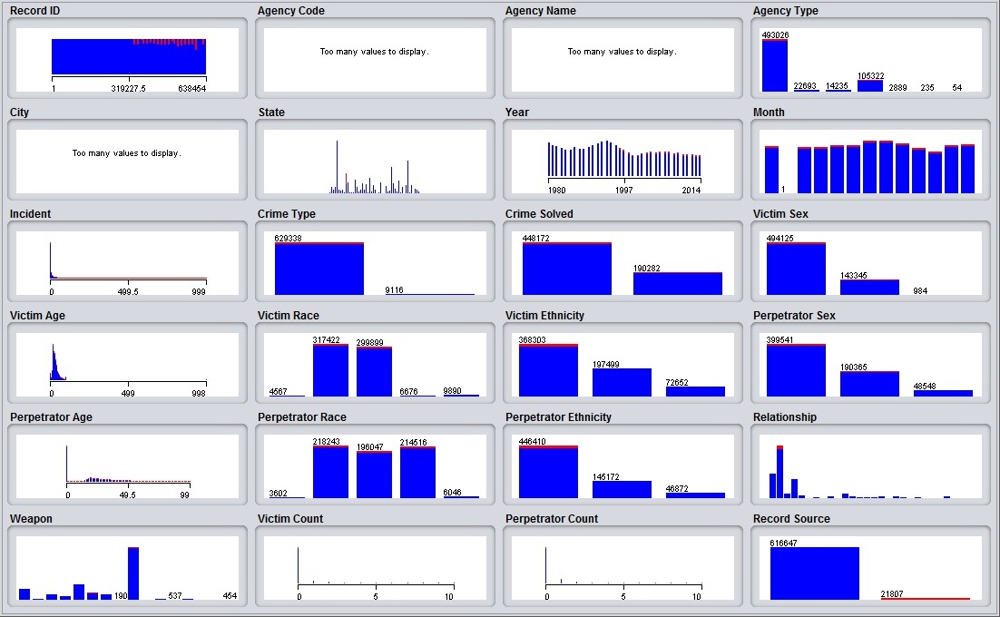

<center>.</center>

## Introducción y motivación

<div style="text-align: justify">
En general, la tasa de resolución de homicidios de los departamentos de policía de Estados Unidos, a través de la detención, ha estado disminuyendo. Desde 1980, más de 220.000 homicidios no han sido resueltos. Cada año, por lo menos 5.000 asesinos escapan con el asesinato. A mediados de los años sesenta, la policía informó la resolución  de más del 80 por ciento de los asesinatos. Hoy en día, un departamento hace bien si resuelve el 65 por ciento de los casos de asesinato pues los principales departamentos logran resolver menos de la mitad de los mismos.


El **Proyecto de Responsabiliad por Asesinatos** o *MAP*, por sus siglas en inglés, está asociado con la base de datos más completa de homicidios en los Estados Unidos actualmente disponible. Este conjunto de datos, o dataset, contiene asesinatos provenientes del reporte de homicidios suplidos por el FBI desde 1976 hasta la actualidad y del acta de libertad de información sobre más de 22.000 homicidios que no fueron reportados al departamento de justicia. Además, este dataset incluye la edad, raza, sexo, y etnia de las víctimas y asesinos, así como también la relación entre éstos y el tipo de arma involucrada.

Como tema para nuestro proyecto, nos pareció interesante los datos contenidos en el dataset ya que conseguimos que a través de los años, pese a que no lo parezca, la mayoría de los asesinatos en Estados Unidos quedan sin resolver. Es por esto que nos motiva conseguir una forma de obtener algún patrón utilizando analítica predictiva para determinar si un futuro caso se resolverá o no.

El objetivo general consiste en predecir la resolución o no de un caso de homicidio en particular en función de sus características propias. Por otro lado, los objetivos específicos son adquirir y preparar el dataset, analizar y ejecutar los algoritmos a utilizar, inspeccionar y comparar resultados, y por último presentar resultados finales utilizando este informe como reporte.
</div>

## Antecedentes 

<div style="text-align: justify">
Inicialmente obtuvimos el dataset de la página [**Kaggle**](http://www.kaggle.com) y obtuvimos un preámbulo inicial acerca del dataset y del tema a tratar, lo que nos condujo a la página oficial [**Murder Data**](http://www.murderdata.org/ ), en la cual se halló información más reciente y completa del Proyecto de Responsabiliad por Asesinatos hasta el año 2015.

A pesar de haber varios estudios sobre el dataset ninguno ha estado enfocado en la resolución de un caso de homicido como el del presente trabajo.
</div>

## Preguntas iniciales 

#### Como equipo nos formulamos las siguientes preguntas antes de enfrentarnos a la solución:
- ¿Qué problema buscamos resolver?
- ¿Se trata de un problema de clasificación?

#### Luego de descargar y indagar el dataset:
- ¿Es aprendizaje es supervisado o no supervisado?
- ¿Cuál es el significado semántico de cada una de las columnas contenidas en el dataset?
- ¿El dataset cuenta únicamente con columnas nominales?
- ¿Qué columnas no aportan relevancia para la solución?
- ¿Cuántas observaciones se manejan en el dataset?

#### De cara al desarrollo de la solución:
- ¿En cuántos subsets nos conviene dividir los datos para solventar de forma eficiente y qué porcentaje de la data contendrá cada uno de ellos?
- ¿Qué algoritmos son los más apropiados para la solución?

## Datos

Las instancias del dataset cumplen con el siguiente formato:

<div style="overflow-x: auto">
Record ID |  Agency Code  |  Agency Name   |   Agency Type   |   City    | State  | Year | Month | Incident | Crime Type | Crime Solved | Victim Sex | Victim Age | Victim Race | Victim Ethnicity | Perpetrator Sex | Perpetrator Age | Perpetrator Race | Perpetrator Ethnicity | Relationship | Weapon | Victim Count | Perpetrator Count | Record Source |
----------- |:---------:|:---------:|:---------------------:|:------------:|:---------:|:---------:|:---------:|:---------:|:---------:|:---------:|:---------:|:---------:|:---------:|:---------:|:---------:|:---------:|:---------:|:---------:|:---------:|:---------:|:---------:|:---------:|:---------:|
1      | AK00101   |   Anchorage    | Municipal Police | Anchorage   | Alaska | 1980 | January | 1 | Murder or Manslaughter | Yes | Male | 14 | Native American/Alaska Native | Unknown | Male | 15 | Native American/Alaska Native | Unknown | Acquaintance | Blunt Object | 0 | 0 | FBI |
</div>
<br><br>
El dataset cuenta con 638.454 observaciones en total y como preprocesamiento en la etapa de limpieza decidimos eliminar ciertas columnas por las siguientes razones:

- Se eliminan por ser datos muy específicos que no aportan utilidad a la solución general (evitar overfitting)
    - Código de la agencia (Agency Code)
    - Nombre de la agencia (Agency Name)

- Se elimina puesto que existe una columna estado como información geográfica y al abarcar la ciudad en ella se obtienen conocimientos más generales
    - Ciudad (City)
    
- Se eliminan porque no se conoce significado semántico de los valores en la columna
    - Incidente (Incident) 
    - Cantidad de autores del homicidio (Perpetrator Count)
    - Cantidad de víctimas (Victim Count)

- Se eliminan porque la mayoría de los valores son 'Unknown' (desconocido) por lo que no aportan relevancia
    - Etnia de la víctima (Victim Ethnicity) 
    - Etnia del autor del homicidio (Perpetrator Ethnicity)
    
Por otro lado, al tratarse de un problema de aprendizaje supervisado, se considera una división inicial de los datos de entrada en dos subconjuntos que incluirán el 70 y 30 por ciento de muestreo respectivamente, que corresponden para entrenamiento y para prueba.

```{r echo=FALSE, include=FALSE}
message("Instalando los paquetes necesarios")
install = function(pkg){
  #Si ya está instalado, no lo instala.
  if (!require(pkg, character.only = TRUE)) {
    install.packages(pkg)
    if (!require(pkg, character.only = TRUE)) stop(paste("load failure:", pkg))
  }
}

install("foreach")

archive = c("rmarkdown", "caret", "rpart", "RWeka", "class", "randomForest")
foreach(i = archive) %do% install(i)
``` 


```{r echo=FALSE}
data <- read.csv(file="database.csv",header=TRUE)

data$Record.ID=NULL
# Se eliminan por ser datos muy específicos que no aportan utilidad a una solución general (evitar overfitting)
data$Agency.Code=NULL
data$Agency.Name=NULL

# Se elimina para manejar únicamente estados del pais
data$City=NULL

#Se elimina porque no se conoce significado semántico de la columna
data$Incident=NULL
data$Perpetrator.Count=NULL
data$Victim.Count=NULL

#Se elimina porque la mayoría de los valores son desconocidos por lo que no aporta relevancia
data$Victim.Ethnicity=NULL
data$Perpetrator.Ethnicity=NULL

dataF <- na.omit(data)
particion = createDataPartition(y=dataF$Crime.Solved, p= 0.7, list=FALSE, times=1)
entrenamiento <- dataF[particion,]
prueba <- data[-particion,]

#Quitándole la columna clase a la partición de prueba
pruebaF <- prueba
pruebaF$Crime.Solved=NULL
```

## Análisis exploratorio

Es importante destacar que ciertas pruebas se realizaron con la herramienta [**Weka**](http://www.cs.waikato.ac.nz/ml/weka/) de la universidad de Waikato, y como el formato de la entrada era CSV fue necesario remover para éstas pruebas todos los caracteres especiales del mismo como apóstrofes (') y comas para su correcta legibilidad.

Una vez se cargaron los datos de manera correcta, pudimos obtener diferentes visualizaciones de las columnas como sigue: <br><br>
<center>.</center>

Posterior a indagar en diferentes algoritmos de analítica predictiva suministrados por Weka, consideramos que los algoritmos que mejor se adaptaron para nuestra solución fueron del tipo árboles de decisión. 

- Modelo C4.5: este algoritmo funciona de modo que en cada nodo del árbol, elige un atributo de los datos que más eficazmente dividen el conjunto de muestras en subconjuntos enriquecidos con la mayor cantidad de instancias en una clase u otra. Su criterio es el normalizado para ganancia de información (diferencia de entropía) que resulta en la elección de un atributo para dividir los datos y el atributo con la mayor ganancia de información normalizada se elige como parámetro de decisión. Ejecutamos este algoritmo especificando que queremos un mínimo de 50.000 instancias en las hojas una vez logre clasificar todas las instancias y un factor de confiabilidad de 0.5 y obtuvimos el siguiente arbol.
<br>
```{r echo=FALSE}
#------------------------------J48---------------------------------------
arbol <- J48(Crime.Solved ~., entrenamiento, control=Weka_control(C = 0.5, M=50000))
plot(arbol, main = "Modelo C4.5")
c1 = confusionMatrix(predict(arbol,pruebaF,type="class"), prueba$Crime.Solved)
c1
```

- Random Forest: genera una cantidad dada de árboles de decisión hechos de forma aleatoria para luego escoger el que arroje mejores resultados de aceptación de acuerdo a la clasificación. Ejecutamos este algoritmo con Cantidad de árboles =  50. En el siguiente gráfico se observa como el índice de error va disminuyendo a medida que se genera más árboles.

```{r echo=FALSE}
#------------------------------Random Forest---------------------------------------
forest <- randomForest(Crime.Solved~.,entrenamiento, ntree=50,norm.votes=FALSE)
plot(forest, main = "Random Forest")
c2 = confusionMatrix(table(predict(forest,pruebaF,type="class"), prueba$Crime.Solved))
c2
#
```

## Análisis final 

Comparamos los 2 escenarios con su respectiva precisión:

Escenario   |     Accuracy    |
----------- |:---------------:|
J48         |`r c1$overall[1]`|
RandomForest|`r c2$overall[1]`|


Se observa que la mayor precisión se obtiene con el arbol que generó el algoritmo Random Forest, por lo que éste es mucho mejor para modelar el problema. Asi mismo, los resultados obtenidos arrojaron alrededor de 134.397 casos resueltos y 57.084 casos sin resolver, equivalentes al 70% y 30% del total de los casos respectivamente. Por último podemos afirmar que tenemos un poco más de certeza al momento de predecir futuros casos de homicidios en USA por haber partido de una base del conocimiento considerablemente grande. 
<br><br>

<center>.</center><br><br>

*Introducción a la ciencia de datos - Semestre II-2016  *